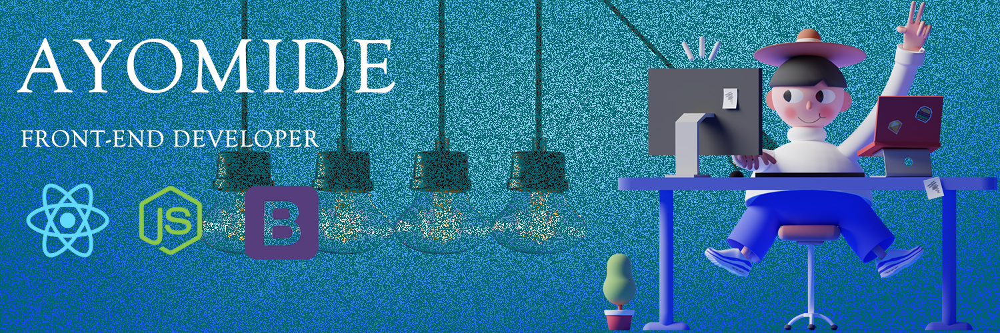

# <h1 align="center">Holla amigo 👋, Ayomide here</h1>

<h3 align="center">I'm a passionate frontend developer from Lagos, Nigeria. I enjoy learning new languages and getting better with the latest technologies and frameworks.</h3>

  

  

- 🌱 I’m currently learning **Reactjs, React hooks, nodejs, web3.**

- 📫 How to reach me **ayofayomi.m@gmail.com**

- ⚡ Fun fact **No such thing as good/bad, ugly/beautiful... There are only perspectives.**

<h3 align="left">Connect with me:</h3>

<h3 align="left">Languages and Tools:</h3>

         

